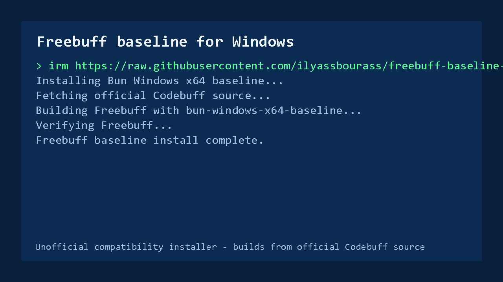
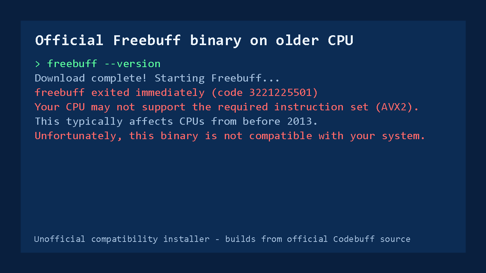
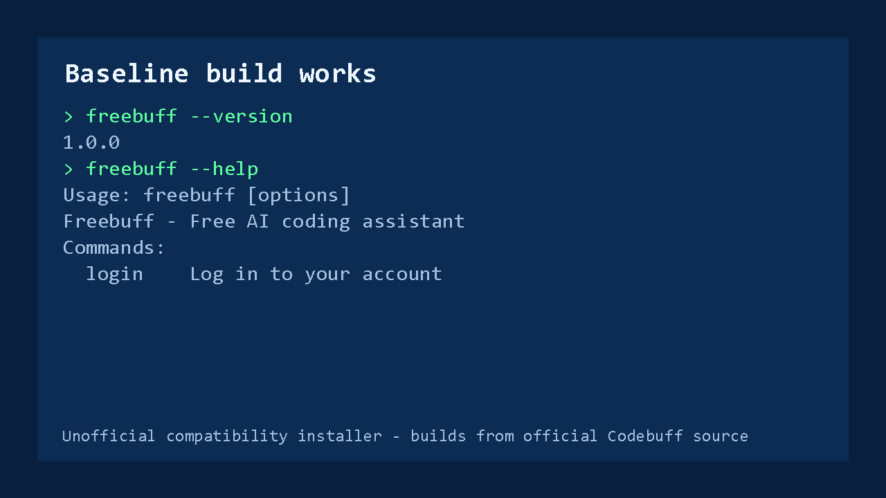

# Run Freebuff on older Windows CPUs without AVX2

Unofficial compatibility installer for Freebuff on older Windows x64 machines.

If the official Freebuff binary exits with an AVX2 or illegal-instruction error, this repo builds Freebuff from the official Codebuff source using Bun's `bun-windows-x64-baseline` runtime.



## Quick Install

Run this in PowerShell:

```powershell
irm https://raw.githubusercontent.com/ilyassbourass/freebuff-baseline-windows/main/install.ps1 | iex
```

Then open a new terminal:

```powershell
freebuff --help
freebuff
```

## Who This Helps

This helps Windows users whose CPU cannot run the official Freebuff binary.

The common failure looks like this:



This workaround was tested on an `Intel Core i5 650`, where the official Freebuff binary failed with an AVX2/illegal-instruction compatibility message.

Important limitation: Bun's baseline build is meant for older x64 CPUs without AVX2, but it still requires a compatible x64 CPU. This will not make every old computer work.

If this fixes your machine, consider starring the repo so other old-CPU Windows users can find it.

Search terms this is meant to help with:

- `freebuff exited immediately code 3221225501`
- `freebuff CPU may not support AVX2`
- `freebuff 0xC000001D`
- `freebuff illegal instruction Windows`
- `freebuff old CPU Windows`
- `freebuff bun-windows-x64-baseline`

## Compatibility Reports

| CPU | Windows | Official Freebuff binary | Baseline installer |
| --- | --- | --- | --- |
| Intel Core i5 650 | Windows x64 | Fails with AVX2 / `3221225501` | Works |

Open a GitHub issue if you test another CPU. Include CPU model, Windows version, and the exact command output.

## What The Installer Does

The installer:

- checks for Node.js, npm, and Git
- installs missing prerequisites with `winget` when available
- installs `@oven/bun-windows-x64-baseline` locally
- clones the official Codebuff repository
- patches the Windows `tar --force-local` build issue when present
- builds Freebuff with `bun-windows-x64-baseline`
- installs `freebuff.cmd` and `freebuff.ps1` launcher shims
- verifies `freebuff --version` and `freebuff --help`

It builds from source instead of downloading a random executable from this repository.

## Result

After install, the normal command works:



```powershell
freebuff --version
freebuff --help
freebuff
```

## Requirements

- Windows x64
- PowerShell
- internet access
- `winget`, or manually installed Node.js LTS and Git
- enough disk space for the Codebuff source tree and dependencies

## Manual Install

```powershell
git clone https://github.com/ilyassbourass/freebuff-baseline-windows.git
cd freebuff-baseline-windows
.\install.ps1
```

Optional custom install path:

```powershell
.\install.ps1 -InstallRoot "$env:LOCALAPPDATA\FreebuffBaselineWindows"
```

## Troubleshooting

### PowerShell blocks the script

Run:

```powershell
Set-ExecutionPolicy -Scope Process Bypass
.\install.ps1
```

### `freebuff` still starts the old binary

Open a new terminal. If that does not fix it, run:

```powershell
where.exe freebuff
Get-Command freebuff
```

The command should resolve to your npm global bin directory, usually:

```text
C:\Users\<you>\AppData\Roaming\npm\freebuff.cmd
```

### Login succeeds in browser but terminal stays on login

This installer sets `NEXT_PUBLIC_CODEBUFF_APP_URL=https://www.codebuff.com` in the launcher shim. That is required for Freebuff's saved token validation. If you edited the shim manually, restore that value.

### Limited mode / country restrictions

This installer only solves the local CPU binary compatibility issue. It does not bypass Freebuff server-side country, quota, account, or model restrictions.

### Upstream Freebuff issues

Related upstream reports:

- [Codebuff issue #654: Freebuff exits immediately on Windows with code 3221225501](https://github.com/CodebuffAI/codebuff/issues/654)
- [Codebuff issue #497: Please add support for old CPU's](https://github.com/CodebuffAI/codebuff/issues/497)

## Uninstall

```powershell
.\uninstall.ps1
```

Remove the build cache too:

```powershell
.\uninstall.ps1 -RemoveBuildCache
```

## Security Notes

Review `install.ps1` before running it. The script is intentionally plain PowerShell so you can inspect every step.

The project builds from the official Codebuff source:

```text
https://github.com/CodebuffAI/codebuff
```

## Unofficial Disclaimer

This project is unofficial and is not affiliated with Codebuff or Freebuff.

Freebuff and Codebuff are projects of their respective owners. This repository only provides a compatibility build workflow for older Windows CPUs.

## Sources

- [Freebuff README](https://github.com/CodebuffAI/codebuff/blob/main/freebuff/README.md)
- [Codebuff repository](https://github.com/CodebuffAI/codebuff)
- [Bun installation docs](https://bun.sh/docs/installation)
- [Bun executable target docs](https://bun.sh/docs/bundler/executables)
- [GitHub README docs](https://docs.github.com/articles/about-readmes/)
- [GitHub releases docs](https://docs.github.com/en/repositories/releasing-projects-on-github/about-releases)
- [OpenSSF Best Practices Badge](https://openssf.org/best-practices-badge/)

## Launch Notes

See [docs/LAUNCH.md](docs/LAUNCH.md) for the publishing checklist, sharing plan, and maintainer notes.

## License

This repository's scripts and documentation are released under the MIT License.

Codebuff is licensed separately by its authors. See the official [Codebuff license](https://github.com/CodebuffAI/codebuff/blob/main/LICENSE).
